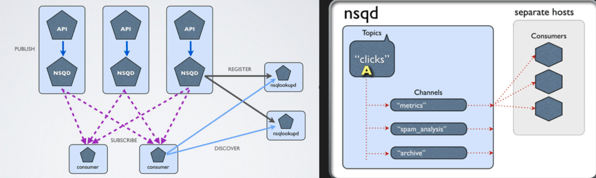

## NSQ 架构

### topic 与 channel 的区别

## topic的作用

topic的作用就和收发快递选哪个快递一样，你选择顺丰，选择圆通。收快件(消费消息)的时候都用这个topic，应该没人收顺丰快递跑到圆通的网点吧。

## channel的作用

- 消息复制
   channel是有大作用的，主要体现在消息复制上。你想实现一条消息两个业务都收到。这里做法就需要用到channel，在同一样topic下面创建两个channel，ch1和ch2。生产者发一条hello nsq，这时候两个业务都会收到hello nsq。(下面给代码验证这个结论)
- 默认用法
   如不需消息复制，就一个topic，一个channel就完事。

首先有比较简单的两个部分，一是数据储存，另外一个是查询服务。

+ 所有的生产者都只和数据节点打交道。生产者直接发送到它比较临近的一个数据节点，这个数据节点会定时将自己的数据上报给查询服务.
+ 消费者消费时通过这个查询服务，可以知道数据到底在哪一个节点上，然后从中拉取数据。

**Channel 堆满后才会落盘**

图右是数据通道的过程。因为它本身是一个比较简化的 MQ，所以架构比较简单。它首先使用 Golang 的 Channel，channel 本身有一个派发过程，所有客户端的链接全部在这个 Channel 上等待。如果 Channel 是满的，它会落盘。如果不满，则一直在 Channel 中流通。所以在整个消费能力不错，没有积压的情况下，整个数据只会在 Channel 中，不会落盘，效率较高。但这个架构本身存在一些问题。

## 参考

+ [有赞-NSQ重塑之路](https://github.com/gopherchina/conference/blob/master/2017/1.5%20NSQ-%E9%87%8D%E5%A1%91%E4%B9%8B%E8%B7%AF.pdf)
+ [NSQ Note](https://xenojoshua.com/2020/12/nsq-note/) 较为全面的介绍了 NSQ

